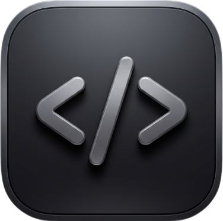

# Code Saver
<p align="center">

</p>
<p align="center">
A Vicinae extension to store and manage your code snippets.
</p>

## Features

- **Create Snippets**: Save code with title, filename, content, and format (freestyle or tldr)
- **Search Snippets**: Find snippets by title, content, or filename
- **Organize**: Use libraries and labels to organize snippets
- **Export**: Copy snippets to clipboard or use in other apps

## Commands

- **Search Code Snippets**: Search and browse your saved snippets
- **Create Code Snippet**: Add a new snippet to your collection

## Demo


## Installation

```bash
npm install
npm run dev
```

Then open Vicinae and search for "Code Saver".
