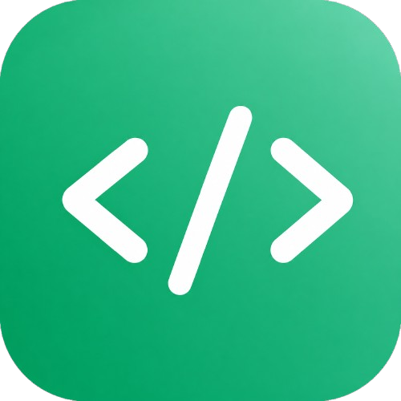
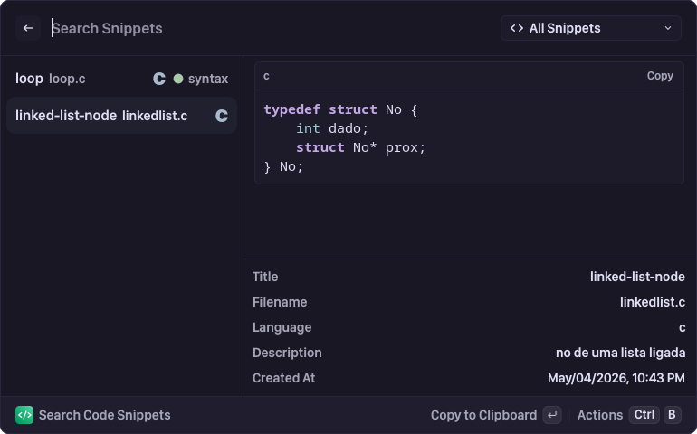

# Code Saver

> Inspired by [Cacher](https://github.com/CacherApp/raycast-extensions/tree/main/extensions/cacher) and [Raycast Code Saver](https://github.com/raycast/extensions/tree/870667fc671801a467deb7c4c7fc72992efe3820/extensions/code-saver/) extensions.

<p align="center">

</p>
<p align="center">
A Vicinae extension to store and manage your code snippets.
</p>

## Features

- **Create Snippets**: Save code with title, description, multiple files, and format (freestyle or tldr)
- **Search Snippets**: Find snippets by title, description, content, or filename
- **Filter by Library/Label**: Use the dropdown filter to narrow down snippets by library or label
- **Organize**: Use libraries and labels to organize snippets
- **Multiple Files**: Attach multiple files to a single snippet
- **Metadata View**: See detailed metadata including creation date, last update, language, labels
- **Export**: Copy snippets to clipboard or use in other apps

## Commands

- **Search Code Snippets**: Search and browse your saved snippets with filtering
- **Create Code Snippet**: Add a new snippet to your collection with multiple file support

## Demo

<p align="center">
  
</p>

## New Features (v0.2.0)

### Filter by Library and Label
Use the dropdown in the search bar to filter snippets:
- All Snippets (default)
- By Library (e.g., "Default", "Personal", etc.)
- By Label (with color indicators)

### Description Field
Each snippet can now have an optional description explaining what it does.

### Multiple Files per Snippet
Attach multiple code files to a single snippet. Each file has:
- Filename
- Content
- Automatic syntax highlighting based on extension

### Enhanced Metadata View
The detail panel now shows:
- Title and filename
- Language (detected from extension)
- Description
- Created/Updated timestamps
- Library
- Format type (Freestyle/TLDR)
- Number of files (if multiple)
- Labels with color indicators

## Installation

```bash
npm install
npm run dev
```

Then open Vicinae and search for "Code Saver".